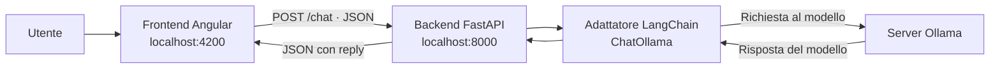
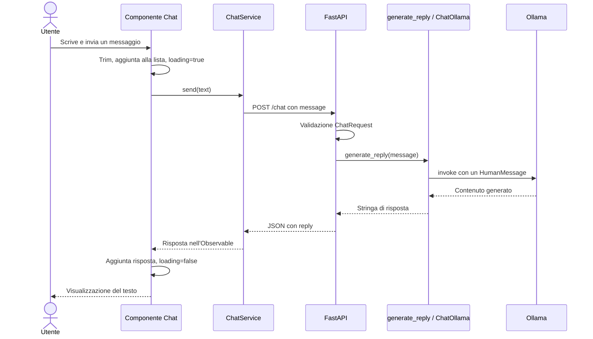

# Architettura del progetto test-llm

## Scopo e stato attuale

Il progetto realizza un assistente personale con un'interfaccia chat web e un modello linguistico eseguito tramite Ollama. L'architettura comprende tre processi separati: frontend Angular, backend FastAPI e server Ollama.

Questa descrizione è basata sul codice presente nel repository. La funzionalità implementata è l'invio di un singolo messaggio e la visualizzazione della risposta completa. Non sono implementati memoria conversazionale del modello, persistenza, autenticazione o recupero di informazioni da documenti (RAG).

## Vista generale



LangChain è una libreria usata dentro il processo backend, non un servizio separato. Il browser comunica con FastAPI; è il backend a conoscere la configurazione di Ollama.

## Organizzazione del codice

```text
test-llm/
├── README.md                       # Istruzioni iniziali
├── ARCHITETTURA.md                 # Questo documento
├── backend/
│   ├── .env.example                # Esempio di configurazione
│   ├── requirements.txt            # Dipendenze Python
│   ├── app/
│   │   ├── __init__.py
│   │   ├── main.py                 # Applicazione HTTP, CORS ed endpoint
│   │   ├── schemas.py              # Modelli di richiesta e risposta
│   │   └── llm.py                  # Configurazione e invocazione del modello
│   └── data/docs/                  # Predisposizione per documenti futuri
└── frontend/
    ├── package.json               # Dipendenze e comandi Angular
    ├── angular.json               # Configurazione build, serve e test
    └── src/
        ├── main.ts                # Avvio dell'applicazione
        ├── styles.scss            # Stili globali
        └── app/
            ├── app.ts             # Componente radice
            ├── app.html           # Contenitore delle rotte
            ├── app.config.ts      # Provider Angular
            ├── app.routes.ts      # Rotte dell'interfaccia
            ├── app.spec.ts        # Test di creazione del componente radice
            ├── chat/
            │   ├── chat.ts        # Stato e interazioni della chat
            │   ├── chat.html      # Vista della chat
            │   └── chat.scss      # Stili della chat
            └── services/
                └── chat.ts        # Client HTTP e tipi dei messaggi
```

## Frontend

Il frontend usa Angular 20, TypeScript, Angular Material, Angular CDK e RxJS. I componenti sono standalone.

### Avvio e navigazione

`src/main.ts` avvia `App` attraverso `bootstrapApplication`. La configurazione in `app.config.ts` registra il router, `HttpClient`, la gestione globale degli errori del browser e il rilevamento delle modifiche basato su Zone.js.

Il componente radice contiene un `router-outlet`. La rotta vuota mostra `Chat`; qualsiasi percorso non riconosciuto viene reindirizzato alla rotta vuota.

### Stato e comportamento della chat

Il componente `Chat` gestisce tre valori principali:

| Valore | Funzione |
| --- | --- |
| `messages` | Signal con i messaggi visualizzati e il relativo ruolo (`user` o `assistant`). |
| `loading` | Signal che indica una richiesta in corso. |
| `draft` | Testo digitato dall'utente, collegato al campo tramite `ngModel`. |

All'invio, il componente rimuove gli spazi iniziali e finali, ignora i messaggi vuoti e impedisce un nuovo invio mentre è in attesa. Aggiunge subito il messaggio dell'utente alla lista, svuota il campo e chiama `ChatService.send()`.

Durante l'attesa, la vista disabilita il campo di testo e il pulsante, mostra una barra di avanzamento e il messaggio «Sto pensando…». Alla risposta aggiunge il testo dell'assistente e riabilita l'invio. Invio spedisce il messaggio; Maiusc+Invio permette di andare a capo. Il componente richiede anche lo scorrimento verso il fondo dopo gli aggiornamenti.

I messaggi sono mostrati tramite interpolazione testuale Angular: non è presente un renderer Markdown.

### Accesso alle API

`ChatService` è un servizio disponibile a livello di applicazione. Usa `HttpClient` e restituisce un `Observable<ChatResponse>` al componente.

L'indirizzo del backend è scritto direttamente nel servizio: `http://localhost:8000`. Il payload contiene soltanto `{ "message": "..." }`; l'array `messages` non viene inviato.

## Backend

Il backend usa Python, FastAPI, Pydantic, python-dotenv e l'integrazione LangChain per Ollama. Uvicorn esegue l'applicazione ASGI. Le dipendenze in `requirements.txt` non hanno versioni fissate.

### Livello HTTP: `app/main.py`

Il modulo crea l'applicazione FastAPI, configura CORS e definisce due endpoint applicativi. La rotta di chat delega la generazione a `generate_reply()`; non contiene la logica di interazione con il modello.

CORS ammette le origini `http://localhost:4200` e `http://127.0.0.1:4200`, con credenziali abilitate e tutti i metodi e gli header consentiti. Questa configurazione regola l'accesso dal browser e non costituisce autenticazione.

### Contratti: `app/schemas.py`

`ChatRequest` richiede un campo `message` di tipo stringa con lunghezza minima pari a 1. `ChatResponse` contiene il campo stringa `reply`.

Il vincolo backend non rimuove gli spazi: una stringa composta solo da spazi soddisfa la lunghezza minima. La pulizia del testo è attualmente responsabilità del frontend. Non è definita una lunghezza massima applicativa.

### Integrazione LLM: `app/llm.py`

Al caricamento del modulo, `load_dotenv()` carica la configurazione dal file `.env` secondo il proprio meccanismo di ricerca. L'avvio previsto dalla cartella `backend` utilizza `backend/.env`.

Il modulo legge nome del modello e URL opzionale del server e costruisce un'istanza `ChatOllama`, riutilizzata dalle richieste del singolo processo backend. Le impostazioni vengono lette all'importazione: modificarle richiede il riavvio del processo per ricreare il client.

`generate_reply(message)` invoca il modello con una lista contenente un solo `HumanMessage`. Restituisce `result.content` se è già una stringa, altrimenti lo converte in stringa. Non aggiunge un prompt di sistema, strumenti o documenti.

L'invocazione è sincrona e la risposta HTTP viene restituita quando la generazione termina. Non sono implementati streaming o elaborazioni in background.

## Flusso di una richiesta



## API ed errori

| Metodo e percorso | Comportamento |
| --- | --- |
| `GET /statu-model-server` | Restituisce `{ "status": "ok" }`. Verifica che l'endpoint backend risponda, senza contattare Ollama. Il nome del percorso è quello effettivamente presente nel codice. |
| `POST /chat` | Riceve `ChatRequest`, invoca il modello e restituisce `ChatResponse`. |
| `GET /docs` | Interfaccia Swagger generata da FastAPI. |

Esempio di richiesta a `/chat`:

```json
{ "message": "Ciao, cosa puoi fare?" }
```

Esempio illustrativo di risposta riuscita, il cui contenuto dipende dal modello:

```json
{ "reply": "Posso aiutarti a rispondere a domande e a scrivere testi." }
```

Se il payload non rispetta lo schema, FastAPI restituisce un errore di validazione HTTP 422. Se la generazione solleva un'eccezione, la rotta restituisce HTTP 503 con `detail` nel formato `LLM non disponibile: ...`, includendo il testo dell'eccezione.

Il frontend mostra un `detail` testuale, quando disponibile. Per gli errori con stato 0 mostra un messaggio di backend non raggiungibile; negli altri casi usa un messaggio generico. L'errore compare sia in uno snackbar per sei secondi sia nella cronologia come messaggio dell'assistente. Non viene effettuato un nuovo tentativo automatico dal codice applicativo.

## Configurazione

| Impostazione | Origine | Effetto |
| --- | --- | --- |
| `OLLAMA_MODEL` | Ambiente o `.env` | Nome del modello, con fallback applicativo a `llama3.1`. |
| `OLLAMA_BASE_URL` | Ambiente o `.env` | URL opzionale passato a `ChatOllama`; se assente viene usato il default della libreria. L'esempio commentato indica `http://localhost:11434`. |
| `LLM_PROVIDER` | `.env.example` | Presente nell'esempio ma non letto dal codice; il provider resta Ollama. |
| URL API del frontend | `frontend/src/app/services/chat.ts` | Costante `http://localhost:8000`. |
| Origini CORS | `backend/app/main.py` | I due indirizzi locali del frontend sulla porta 4200. |
| Etichetta modello nella toolbar | `frontend/src/app/chat/chat.html` | Testo fisso `Ollama · llama3.1`, non sincronizzato con `OLLAMA_MODEL`. |

`backend/.env` è escluso dal versionamento tramite `.gitignore`. Per cambiare modello si modifica la configurazione backend e si rende disponibile quel modello su Ollama; l'etichetta frontend va aggiornata separatamente se deve riflettere la scelta.

## Dati e memoria conversazionale

La cronologia vive esclusivamente nel componente Angular e viene persa ricaricando la pagina o ricreando il componente. Il progetto non salva conversazioni in database, file o storage del browser.

Ogni richiesta al modello è indipendente: vedere messaggi precedenti nell'interfaccia non significa che il modello possa consultarli. Per esempio, dopo «Mi chiamo Luca», un successivo «Come mi chiamo?» viene inviato senza la frase precedente.

`backend/data/docs/` contiene una predisposizione per sviluppi futuri. Il codice attuale non carica questi documenti e non implementa embedding, indice vettoriale o ricerca RAG.

## Esecuzione locale e verifica

Il flusso di sviluppo prevede Ollama in esecuzione con il modello scaricato, le dipendenze Python installate in un ambiente virtuale e le dipendenze frontend installate. La configurazione di esempio si copia in `backend/.env`.

Dal terminale nella cartella `backend`, con l'ambiente virtuale attivo:

```powershell
uvicorn app.main:app --reload --port 8000
```

Da un secondo terminale nella cartella `frontend`:

```powershell
npm start
```

Il browser apre `http://localhost:4200`. Per verificare il flusso completo serve inviare un messaggio alla chat: il solo endpoint di stato non verifica né il collegamento a Ollama né la disponibilità del modello.

La configurazione Angular include `npm run build` per la build e `npm test` per i test Jasmine/Karma. Il test presente verifica la creazione del componente radice; non copre il flusso chat. Non risultano test backend o test end-to-end nel codice esaminato. Questo documento deriva dalla lettura dei sorgenti, non da una verifica dei servizi in esecuzione.

## Punti di estensione

Le responsabilità sono separate in modo da individuare dove intervenire:

- **Interfaccia e stato:** `frontend/src/app/chat/`, per nuove interazioni o visualizzazioni.
- **Trasporto e contratto:** servizio frontend, `schemas.py` e `main.py`, da mantenere coerenti quando cambiano i dati scambiati.
- **Modello e prompt:** `llm.py`, per istruzioni di sistema o diversa logica di generazione.
- **Memoria conversazionale:** richiederebbe l'invio della cronologia o la gestione di sessioni nel backend; non basta conservare la lista nella vista.
- **RAG:** richiederebbe caricamento, indicizzazione e recupero dei documenti prima dell'invocazione del modello.
- **Distribuzione fuori dall'ambiente locale:** richiederebbe almeno di adattare URL frontend e origini CORS alla destinazione. Nel repository non è presente una configurazione di deployment dedicata.

Questi punti descrivono possibili evoluzioni e non funzionalità già disponibili.
